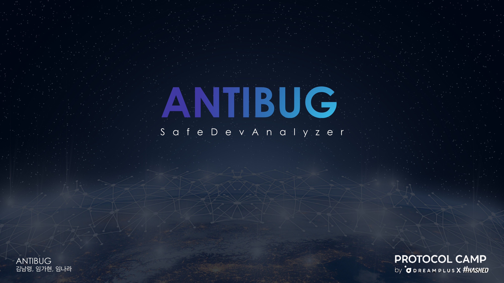
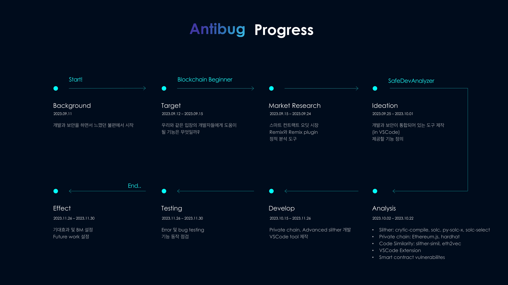
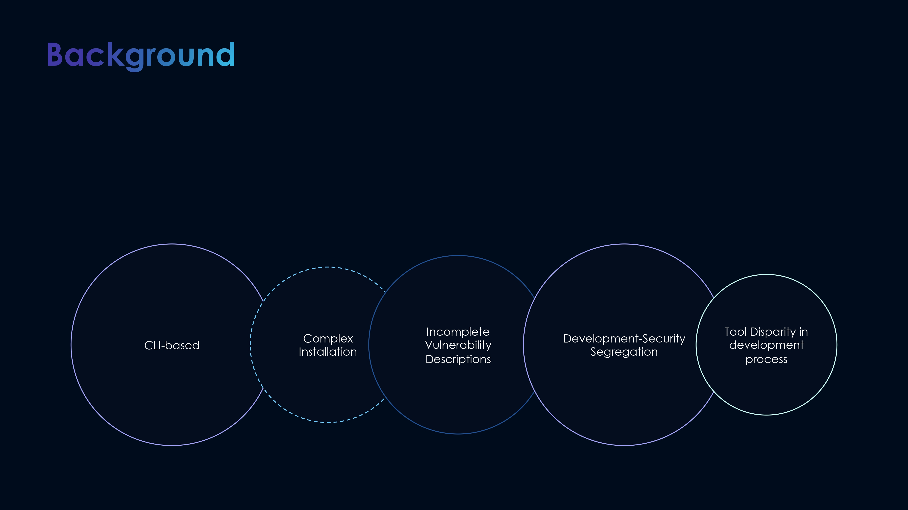
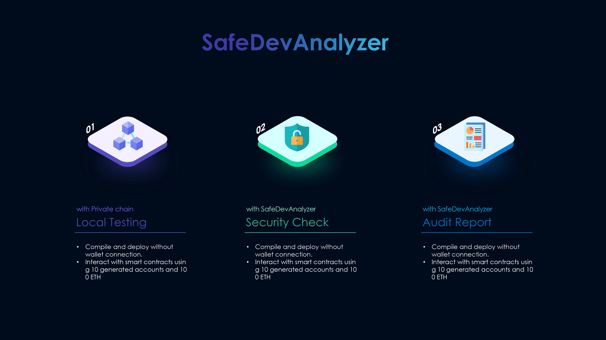
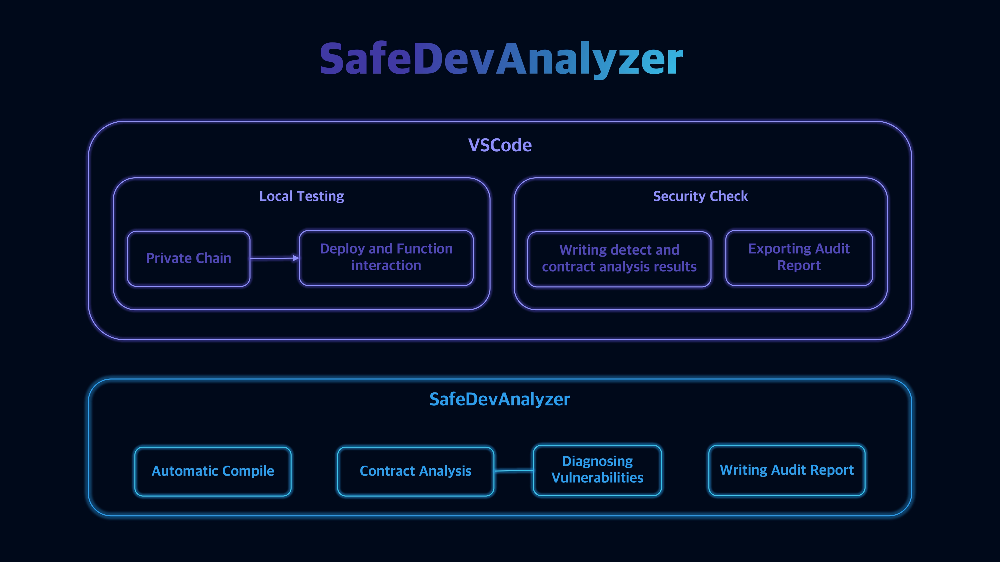
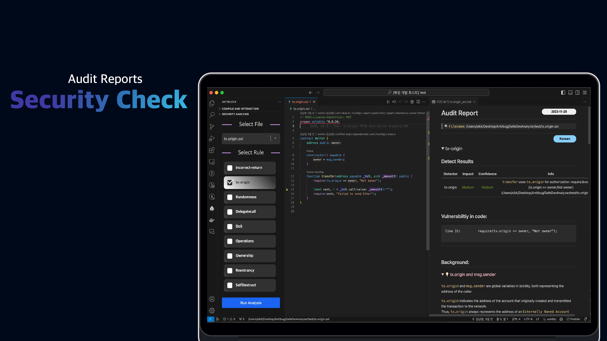
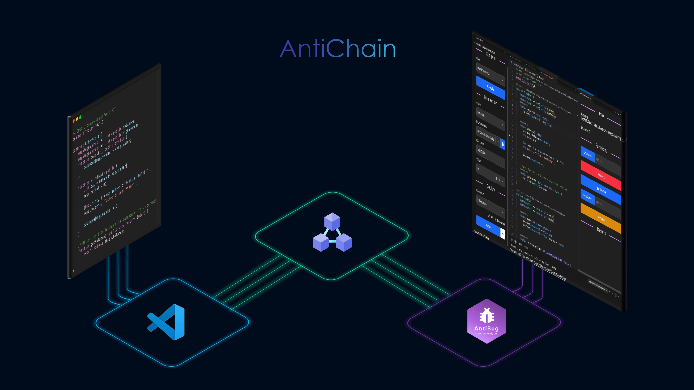
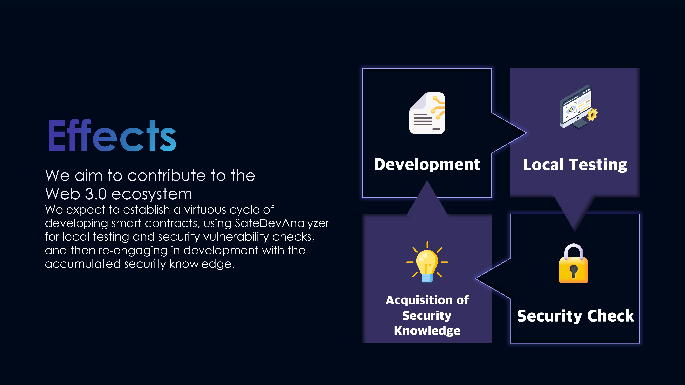

# Antibug – Smart Contract Security Analyzer  
*A VSCode extension that helps developers detect smart contract vulnerabilities during development.*

<br>

---

<br>

## 프로젝트 개요 (Overview)

**Antibug**는  
스마트 컨트랙트 개발 과정에서 발생할 수 있는 보안 취약점을  
개발자가 직접, 손쉽게 점검할 수 있도록 돕는  
**VS Code 기반 스마트 컨트랙트 분석 확장 프로그램**입니다.

- 프로젝트 기간: **2023.09 – 2023.12**  
- 프로그램: **Protocol Camp 5기**  
- 프로젝트 성격: 팀 프로젝트  
- 성과: **Protocol Camp 5기 최우수상**  

<br>

Antibug is a VS Code extension designed to help developers  
identify **smart contract vulnerabilities early in the development stage**,  
without requiring deep security expertise.

- Project period: **Sep 2023 – Dec 2023**  
- Program: **Protocol Camp Cohort 5**  
- Type: Team-based project  
- Achievement: **Best Project Award**

<br>

---

<br>

## 문제 정의 (Problem)

스마트 컨트랙트 산업이 빠르게 성장하고 있음에도 불구하고,  
보안 도메인에 대한 전문 지식이 없는 개발자가  
취약점을 사전에 점검하기에는 진입 장벽이 높습니다.

기업에서는 외부 오딧(Audit)을 통해 이를 해결하지만,  
**시간과 비용 부담**으로 인해 개인 개발자나 스타트업에게는  
현실적인 대안이 되기 어렵습니다.

<br>

As the smart contract industry continues to grow,  
developers without a security background face significant challenges  
in identifying vulnerabilities during development.

While professional audits are commonly used in industry,  
their **cost and time requirements** make them impractical  
for individual developers and early-stage startups.

<br>

---

<br>

## 해결 방식 (Solution)

기존 정적 분석 도구인 **Slither**를 기반으로 제작한 **SafeDevAnalyzer**는,  
개발자가 사용하는 **VS Code 환경에서 즉시 보안 분석 결과를 확인**할 수 있도록 설계되었습니다.

보안 전문가가 아니어도  
**개발 단계에서 취약점을 인지하고 대응할 수 있는 환경**을 제공하는 것을 목표로 했습니다.

<br>

SafeDevAnalyzer, built on top of the existing static analysis tool **Slither**,  
was designed to allow developers to **immediately view security analysis results  
within their VS Code environment**.

The goal was to provide an environment where  
developers can **identify and respond to vulnerabilities during development**,  
even without specialized security expertise.

<br>




### 주요 기능
- Private chain 기반 Local testing 환경 구축  
- Smart contract 정적 분석 수행  
- 취약점 분석 결과를 시각화한 Analysis Graph 제공  
- 보안 점검 결과를 정리한 Security Check Report 생성  
- Smart contract 함수 단위 Operation 테스트 지원  

<br>

### Key Features
- Local testing environment using a private blockchain  
- Static analysis of smart contracts  
- Visualized smart contract analysis graphs  
- Automatically generated security check reports  
- Function-level operation testing for smart contracts  

<br>

---

<br>

## 기술적 접근 (Technical Approach)

- **JavaScript / TypeScript**  
  VS Code 확장 프로그램 개발 및 안정적인 코드 구조를 위해 사용  

- **VS Code Extension API**  
  개발 환경에 자연스럽게 통합된 보안 분석 경험 제공  

- **Slither**  
  스마트 컨트랙트 정적 분석을 위한 핵심 엔진으로 활용  

- **Blockchain (Private Chain)**  
  로컬 환경에서의 안전한 테스트 및 시뮬레이션 지원  

<br>

기술 선택은 최신성보다,  
**실제 개발자가 사용할 수 있는 실용성과 안정성**을 기준으로 결정했습니다.

<br>

- **JavaScript / TypeScript**  
  Used to ensure maintainable and reliable extension development.

- **VS Code Extension API**  
  Enabled seamless integration into developers’ existing workflows.

- **Slither**  
  Adopted as the core static analysis engine for smart contract security.

- **Private Blockchain Environment**  
  Used to support safe local testing and function-level validation.

<br>

All technical decisions focused on  
**practical usability and real-world developer workflows**.

<br>

---

<br>

## 역할 및 기여도 (Role & Contribution)

### 팀 구성
- **팀장**: 김남령  
- **팀원**: 임가현, 임나라  

### 담당 역할
- 프론트엔드 및 VS Code 확장 프로그램 UI 구현  
- 보안 분석 결과 시각화 기능 개발  
- Slither 분석 결과와 UI 연동  
- 사용자 관점에서의 기능 흐름 및 사용성 개선  

프로젝트 전반에서 **개발자 경험(DX)을 중심으로 한 기능 구현**에 기여했습니다.

<br>

### Team Structure
- **Team Lead**: Kim Namryeong  
- **Team Members**: Lim Kahyun, Lim Nara  

### Responsibilities
- Developed the frontend and VS Code extension UI  
- Implemented visualization of security analysis results  
- Integrated Slither analysis outputs into the extension interface  
- Improved usability and feature flow from a developer’s perspective  

<br>

---

<br>

## 결과 및 인사이트 (Outcomes & Learnings)

- 스마트 컨트랙트 보안 문제를 **개발 단계에서 해결하는 접근 방식**의 중요성 학습  
- 보안 도구를 개발자 친화적인 형태로 제공하는 UX/DX 설계 경험  
- 실제 산업 환경을 가정한 보안 프로젝트 수행 경험  
- **Protocol Camp 5기 최우수상 수상**

<br>

- Hands-on experience in smart contract security tooling  
- Learned the importance of developer-centric security UX  
- Experience building a production-like tool in an industry program  
- Awarded **Best Project at Protocol Camp Cohort 5**

<br>

---

<br>

## 프로젝트 배경 (Context)

본 프로젝트는  
**Hanwha X Hashed가 주관한 Protocol Camp 5기**에서 진행된 팀 프로젝트입니다.

실무 환경에서 활용 가능한  
**스마트 컨트랙트 보안 도구 개발 경험**을 목표로 진행되었습니다.

<br>

This project was developed as part of  
**Protocol Camp Cohort 5, powered by Hanwha X Hashed**.

It focuses on building a **practical security tool**  
that can be applied in real-world smart contract development workflows.

<br>

---

<br>

## 실행 방법 (Run Locally)

```bash
git clone https://github.com/khlang12/anti-bug.git
# Open the project in VS Code and run the extension
```
